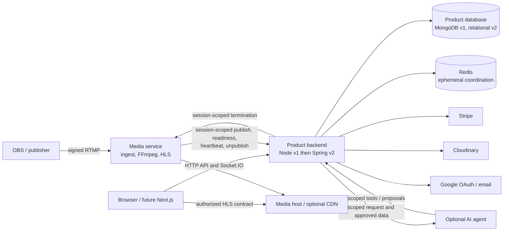

# OmexLive System Architecture v1

**Status:** System-level architecture specification for planning and future implementation. It defines authority, runtime boundaries, cross-system contracts, failure behavior, and the Node v1 to Spring v2 compatibility obligations. It does not authorize a production refactor, deployment change, dependency installation, new service, or database migration.

**Companion authorities:** [DESIGN_SYSTEM.md](DESIGN_SYSTEM.md) governs visual language and UI interaction; [FRONTEND_STANDARDS.md](FRONTEND_STANDARDS.md) governs frontend engineering and the future Next.js application; [BACKEND_STANDARDS.md](BACKEND_STANDARDS.md) governs backend engineering and Node v1 stabilization. This document resolves system ownership and communication between those areas. It does not replace their detailed rules.

**Decision language:** **LOCKED** is a system rule for v1 planning and implementation. **PROVISIONAL** is a preferred candidate that can change after review. **NEEDS VALIDATION** requires code, contract, or deployment evidence. **EXTERNAL / DEPLOYMENT DECISION** requires an approved hosting or operations choice. **PRODUCT DECISION** requires a product policy. **CURRENT / CONFIRMED** describes checked-in repository behavior, not proof that a production deployment is running. “Must” is normative; “should” is the default with a documented exception; “may” is permitted.

## 1. Purpose and Scope

OmexLive combines a browser application, product backend, media pipeline, realtime transport, durable product data, external providers, and an optional AI advisor. Architecture must let an engineer identify who decides a product fact, which interface carries it, what happens on failure, and what remains stable when Node/Express/MongoDB is later replaced by Spring Boot and a relational database.

This document describes the checked-in system and the target boundary. It does not select an SQL schema, a cloud vendor, a queue, a gateway product, or an exact migration date. Existing source paths are evidence; target contracts are explicitly marked. Repository-level behavior is based chiefly on [docker-compose.yml](docker-compose.yml), [backend/index.js](backend/index.js), [media-service/index.js](media-service/index.js), and the three companion standards.

## 2. Architecture Principles

1. **LOCKED — One authority per decision.** Backend owns product/business truth; the product database stores its durable state. Media owns media mechanics, Redis supports realtime coordination, Stripe owns external payment state, the agent produces advice, and frontend owns presentation/interaction. A cache, event, URL, or provider response is not a second product authority.
2. **LOCKED — Separate product control from media bytes.** Backend decides viewability, stream state, and authorized playback terms. Media host/CDN delivers HLS efficiently. High-volume HLS traffic must not unnecessarily traverse the product backend.
3. **LOCKED — Explicit identities and replay rules.** Service credentials authenticate a service, not an acting creator or admin. Each broadcast must be distinguishable from older broadcasts; repeated and late callbacks must not mutate a newer session.
4. **LOCKED — Stable behavior across technology changes.** Public and internal contracts describe product semantics independently of Mongoose and of Java persistence classes. Changing server language or database technology alone does not require a new API version.
5. **LOCKED — State the consistency class.** Local database business units can be strongly consistent. Provider/media workflows need idempotency and reconciliation. Realtime delivery is generally best effort; presence is ephemeral. No distributed transaction is assumed.
6. **LOCKED — Failure isolation.** Optional advice or an unavailable payment provider must not become a prerequisite for watching or publishing where their own dependencies remain healthy. Degradation claims must be verified against the deployed topology.

## 3. Current System Context

**CURRENT / CONFIRMED:** The frontend is a Vite/React/TypeScript SPA built into an Nginx image; it calls Express HTTP APIs and Socket.IO, and plays HLS with Hls.js/Plyr. The backend serves REST, authentication, Socket.IO, stream lifecycle, economy, content and integrations. The media service handles signed OBS RTMP publishing, FFmpeg, HLS files, heartbeat and termination. MongoDB is the durable product store; Redis is used by Socket.IO and transient presence/moderation. [frontend/src/App.tsx](frontend/src/App.tsx), [backend/index.js](backend/index.js), [media-service/src/config/mediaServer.config.js](media-service/src/config/mediaServer.config.js), [docker-compose.yml](docker-compose.yml).

Stripe supplies PaymentIntent state; Cloudinary stores uploaded video/images; Brevo SMTP sends account email; Google supplies OAuth identity. An optional S3-compatible object store/CDN may mirror and serve HLS. The Python agent directory has scheduler/moderator tools, but its main HTTP entry point and orchestrator are empty and no Dockerfile is checked in. Compose declares an optional agent profile; it is an intended integration, not a verified running API. [backend/src/controllers/CreatorCoachController.controller.js](backend/src/controllers/CreatorCoachController.controller.js), [agent-service/main.py](agent-service/main.py), [media-service/src/services/hlsUploader.service.js](media-service/src/services/hlsUploader.service.js).

**CURRENT / CONFIRMED deployment declaration:** Compose exposes frontend 80, backend 5000, RTMP 1935, media HTTP 8000/8080, MongoDB 27017, Redis 6379 and optional agent 8001. The backend waits for Mongo initialization and Redis health; media waits for backend health and Mongo initialization. Those declarations are not evidence of production ingress isolation or actual availability. The checked-in [frontend/nginx.conf](frontend/nginx.conf) has apparent syntax errors; deployment validation must include its configuration.

## 4. Target System Context

The future frontend is Next.js and the future product backend may be Spring Boot. Neither change creates a second product authority. The diagram shows a conceptual target, not a selected network or cloud deployment.

**LOCKED:** The target media authorization/session contract is backend-owned. Media must not depend on the product database schema as its long-term integration contract. This is a prerequisite for a clean Node/MongoDB to Spring/relational transition; the exact backend-controlled credential or validation mechanism is **NEEDS VALIDATION**.

## 5. Runtime Responsibility Matrix

| Runtime | Responsibility and authoritative state | Interfaces and dependencies | Lifecycle / failure impact |
|---|---|---|---|
| Frontend / future Next.js | Presentation, route/form/player state, client cache; no product authority | Inbound page requests; outbound backend HTTP/Socket.IO and media HLS | UI failure blocks new user interaction. Authenticated server rendering depends on the approved host/cookie topology. |
| Product backend | Auth, roles, ownership, visibility, stream product lifecycle, economy, notifications, approved analytics and agent actions | Browser API/Socket.IO; media/agent/provider callbacks; product DB, Redis and providers | Required for new business actions and realtime control. It must not proxy all HLS bytes. |
| Media service | RTMP ingest, publisher process, FFmpeg, HLS generation/delivery, media termination | OBS RTMP; backend control/callbacks; local media files; optional object storage | Failure affects publishing and live playback. Current direct MongoDB key-registry dependency is debt. |
| Product database | Durable product records and local transaction boundary | Backend; currently also media key registry | Failure blocks authoritative product reads/writes and current media startup. Future relational storage replaces MongoDB behind backend contracts. |
| Redis | Socket.IO adapter coordination, ephemeral presence and stream-local moderation | Backend Socket.IO and transient stores | Loss can degrade multi-instance delivery and transient state; it does not erase durable product records. |
| Agent service | Intended optional creator advice and approved tool use; no product authority | Backend request/tools, external model provider | Checked-in HTTP runtime is incomplete. Agent failure must leave core streaming/viewing usable. |
| External providers | Stripe: payment outcome; Cloudinary: asset bytes; Google: OAuth; Brevo: email; optional S3/CDN: HLS bytes | Provider APIs, OAuth/webhook/email/media delivery | Each failure affects its own feature; backend must reconcile uncertain cross-system outcomes. |

## 6. Authority Matrix

| Decision or state | Authoritative owner | Derived/supporting representation |
|---|---|---|
| User identity, session validity, roles, ownership | Backend using durable product data | HTTP-only JWT cookie, frontend profile snapshot, Socket.IO actor context |
| Video/stream metadata and visibility | Backend using durable product data | Frontend lists, metadata, Cloudinary/media URLs |
| Active broadcast and public LIVE meaning | Backend | Media publish/readiness/heartbeat observations; frontend LIVE display |
| RTMP publisher, transcode and HLS files | Media service | Backend stream session and playback contract |
| Presence, chat and reactions in flight | Backend Socket.IO, coordinated by Redis where configured | Client room buffers; not durable product history |
| Coin balances, donations and payment fulfillment | Backend using durable product data | Stripe payment status is separately authoritative for external payment outcome |
| Notification existence/read state | Backend using durable product data | Socket delivery and UI badges |
| Analytics definitions and approved source data | Backend | Agent explanations and frontend charts |
| AI answer/proposal | Agent | Backend verifies any data/action contract and alone executes product changes |

**CURRENT / CONFIRMED deviations:** Media reads MongoDB user/stream-key fields directly; Redis or process memory alone holds current stream chat bans; some content reads and stream payloads do not yet meet target visibility/LIVE semantics. These are gaps to close, not shared-authority exceptions. [streamKeyRegistry.service.js](media-service/src/services/streamKeyRegistry.service.js), [moderation.store.js](backend/src/sockets/moderation.store.js), [VideoController.controller.js](backend/src/controllers/VideoController.controller.js), [streamPayload.js](backend/src/utils/streamPayload.js).

## 7. Trust Boundaries

| Boundary / identity | Required architectural check | Current evidence or gap |
|---|---|---|
| Browser → backend HTTP/Socket.IO; end user or anonymous viewer | Treat input as untrusted; authenticate session where needed; authorize each action and resource | Cookie/Bearer HTTP auth; Socket cookie auth permits anonymous viewing but restricts chat. [Auth.middleware.js](backend/src/middlewares/Auth.middleware.js), [auth.socket.js](backend/src/sockets/auth.socket.js) |
| Admin → backend | Verify current backend role and action-specific policy | Frontend role checks are navigation UX only. |
| OBS → media | Validate signed publish and credential revocation | NodeMediaServer signed publish plus current Mongo-backed key registry. [mediaServer.config.js](media-service/src/config/mediaServer.config.js) |
| Media ↔ backend | Authenticate service, validate input and target active session, reject stale/replayed state changes | Shared x-media-service-secret exists; callback session scope is incomplete. [MediaServiceAuth.middleware.js](backend/src/middlewares/MediaServiceAuth.middleware.js), [mediaControl.js](backend/src/utils/mediaControl.js) |
| Backend ↔ agent | Authenticate service and separately bind acting user, resource, capability and approval | Shared x-agent-secret exists; current tool paths can bypass ownership checks. [Auth.middleware.js](backend/src/middlewares/Auth.middleware.js), [ModerationController.controller.js](backend/src/controllers/ModerationController.controller.js) |
| Stripe → backend | Verify signed raw webhook and payment attributes before fulfillment | [backend/index.js](backend/index.js), [CoinController.controller.js](backend/src/controllers/CoinController.controller.js) |
| Backend → Cloudinary/email/Google/model provider | Keep provider credentials server-side; validate returned IDs/status; plan for timeouts and uncertain results | Provider state is outside product DB transactions. |

**LOCKED:** Internal does not mean trusted without authentication. A service identity never becomes arbitrary end-user authority. Socket payloads, media callbacks, provider responses and agent output remain untrusted data after transport authentication.

## 8. Frontend ↔ Backend Boundary

**LOCKED:** Backend authorizes users and owns product state, visibility, prices, coin movement, payment fulfillment and stream lifecycle. Frontend owns presentation, locale-aware navigation, local form/dialog/player behavior and an explicit client cache. HTTP APIs carry commands and query DTOs; Socket.IO carries realtime room events and transient updates; media URLs carry playback bytes under backend-approved access terms. Socket events should reconcile durable client queries rather than become a second durable source of truth.

The future frontend uses /vi and /en route prefixes with stable resource path segments. Backend DTOs and notification destinations must support those routes without exposing MongoDB document/populate shapes. Only backend-approved public resources may enter indexable metadata. The current Vite app remains the baseline during migration; Next.js server-side personalized reads require a deployment topology that actually exposes the backend session to the server. See [FRONTEND_STANDARDS.md](FRONTEND_STANDARDS.md) for rendering, state, localization and route implementation rules.

## 9. Backend ↔ Media Boundary

**CURRENT / CONFIRMED flow:** Creator prepares a non-live stream through backend. OBS connects to the media RTMP server with a signed publish credential. Media validates the signature and checks its in-memory key registry, which is refreshed directly from MongoDB. Media calls backend publish, receives a playback ID, starts FFmpeg/HLS, sends heartbeats, and calls unpublish on normal disconnect. Backend-to-media termination uses an authenticated internal control endpoint. [StreamController.controller.js](backend/src/controllers/StreamController.controller.js), [mediaServer.config.js](media-service/src/config/mediaServer.config.js), [media-service/index.js](media-service/index.js).

**LOCKED target:** Backend owns creator authorization, stream resource, active-session identity, legal transitions and public LIVE/visibility decisions. Media owns publisher validation mechanics, transcode process, HLS artifact readiness and termination mechanics. Media authorization must use an approved backend-owned contract or equivalent backend-controlled credential mechanism; media must not read product database schema as its long-term contract.

For every cross-service command/callback, define authenticated service identity, active-session correlation, payload validation, timeout, bounded retry, idempotent result, stale-event response and trace identifiers. Current media callbacks time out after five seconds, but publish/unpublish retry and replay guarantees are incomplete; exact target semantics are **NEEDS VALIDATION**. Backend must not infer media readiness solely from a successful publish callback.

## 10. Stream Session & Playback Contract

| Identity | Meaning | Exposure / replay concern |
|---|---|---|
| Creator/user ID | Account that owns the stream | Public profile identity may be exposed; does not identify one broadcast. |
| Logical stream resource ID | Product record, metadata and route target | Public opaque identifier; may outlive one broadcast. |
| Private ingest credential | Authorizes OBS publishing | Sensitive; rotate/revoke; never use as public playback or callback session identity. |
| Active broadcast-session identity | One actual publishing attempt/session | **LOCKED:** late callbacks from an older session cannot mutate a newer one. Exact field/token/version is **NEEDS VALIDATION**. |
| Public playback identity | Locates HLS artifacts for one broadcast | Appears in a returned HLS URL; it is not a secret or a complete viewer authorization scheme. |

**LOCKED LIVE semantics:** Publisher connected or ingest accepted is not automatically publicly playable LIVE. Backend must represent a preparation interval or equivalent semantics until the current session is playable. A readiness observation from media and its timeout/verification rule are **NEEDS VALIDATION**. Public stream payload, discovery, Socket events, metadata and Design System LIVE indicators must agree on that meaning. Current publish sets isLive before media has proven HLS readiness; the serializer can retain isLive while withholding the HLS URL after a stale heartbeat. [StreamController.controller.js](backend/src/controllers/StreamController.controller.js), [streamPayload.js](backend/src/utils/streamPayload.js).

**LOCKED delivery principle:** Browser receives an authorized playback contract from backend, then fetches playlists/segments from media HTTP or a CDN, without routing bulk HLS bytes through the product backend. Current HLS URLs come from CDN_BASE_URL or MEDIA_SERVICE_URL; local media delivery allows cross-origin access and gives playlists no-store behavior. HLS CORS, cache propagation, stale segment cleanup and media-host availability require deployment tests. [hlsUrl.js](backend/src/utils/hlsUrl.js), [media-service/index.js](media-service/index.js), [hlsUploader.service.js](media-service/src/services/hlsUploader.service.js).

**LOCKED private-media target:** “Public” means publicly discoverable and viewable. “Private” means unauthorized users cannot consume the underlying asset even if its URL is known. Protected/signed delivery is therefore a required architectural capability before private media can be called truly private; it is not implemented here. Current direct Cloudinary/HLS URLs do not by themselves enforce that privacy. A future “unlisted” discoverability-by-link state is optional and not part of required v1 scope.

## 11. Realtime & Redis

**CURRENT / CONFIRMED:** Backend Socket.IO authenticates via cookie when available, assigns stream rooms, handles chat/reactions and tracks presence. Redis supplies the Socket.IO adapter plus transient presence and moderation stores; code falls back to process memory when Redis is unavailable. Presence/heartbeat data expires and does not form a durable audience history. [backend/src/sockets/index.js](backend/src/sockets/index.js), [presence.store.js](backend/src/sockets/presence.store.js), [moderation.store.js](backend/src/sockets/moderation.store.js).

**LOCKED:** Redis is supporting ephemeral coordination, not durable product authority or an implied job queue. Transient stream-local presence and moderation may live there. Durable account/channel/platform moderation belongs in durable product state. Whether current stream chat bans themselves must survive restart is a **PRODUCT DECISION**. Multi-replica behavior during Redis loss is **NEEDS VALIDATION**; process-local fallback cannot be assumed globally consistent. Realtime events may be duplicated, missed or late, so clients re-query authoritative data for durable stream status, balance and notifications.

## 12. Persistence & Data Ownership

The product database stores users/roles, content and visibility state, stream records, balances, donations, top-ups, notifications and other durable product facts. MongoDB/Mongoose is the **CURRENT / CONFIRMED** implementation; a relational database/JPA is a future implementation choice already described in Backend Standards. Database implementation is not business architecture. The media service’s current direct read of MongoDB User.streamKey is an architectural debt that must be removed before product persistence can change independently. [backend/src/models](backend/src/models), [streamKeyRegistry.service.js](media-service/src/services/streamKeyRegistry.service.js).

Redis holds transient coordination. Media filesystem and optional S3-compatible storage hold generated HLS artifacts, with media-owned cleanup. Cloudinary holds uploaded asset bytes and provider IDs; Stripe holds PaymentIntent state. The backend retains the product record linking each provider identity to ownership, visibility and fulfillment. Public IDs should be opaque at contract boundaries; provider payment/asset IDs, stream/session correlations and migration-critical relationships must survive data migration. No SQL schema or data-copy procedure is selected here.

## 13. External Providers

| Provider | Authority and boundary | Failure / consistency expectation |
|---|---|---|
| Stripe | External payment status; backend owns packages, coin credit and fulfillment | Verify signature or retrieve status, amount, currency and metadata; reconcile ambiguous outcomes before retry. |
| Cloudinary | Uploaded video/image bytes and provider asset IDs; backend owns content state | Upload/delete can leave orphaned or missing assets; cleanup/reconciliation must be observable. |
| Google OAuth | External identity proof in login flow; backend issues its own session | Callback, redirect and cookie behavior depend on approved host topology. |
| Brevo SMTP | Email delivery for OTP/account workflows | Email transport failure affects that workflow; it is not the durable notification record. |
| Optional S3-compatible store/CDN | HLS artifact replication and efficient delivery | Cache, origin, CORS, lifecycle and availability remain deployment choices. |
| External model provider | Agent inference only, if agent is completed | Advice must be grounded in approved backend data and must not grant product authority. |

## 14. Economy / Payment Flow

**Top-up — CURRENT / CONFIRMED:** Browser requests a backend-defined coin package; backend creates a Stripe PaymentIntent and pending TopUp. Browser uses Stripe Elements for confirmation. A backend confirmation query or signed webhook verifies provider outcome and matching user, currency and amount. Backend conditionally claims the pending TopUp and increments balance in a MongoDB transaction. An uncertain provider/database result requires reconciliation; a browser success response alone never credits coins. PaymentIntent creation and local record creation are not a distributed transaction. [CoinController.controller.js](backend/src/controllers/CoinController.controller.js).

**Donation — CURRENT / CONFIRMED:** Browser sends recipient, amount and idempotency key. Backend checks authorization and sufficient balance, then debits, credits and records the donation as one local transaction. Notification creation and Socket.IO emission follow commit and are best effort. A repeated key must return the existing outcome rather than transfer twice. These invariants remain stable in Spring even if their database mechanism changes.

## 15. Content / Asset Flow

**CURRENT / CONFIRMED upload:** Browser sends multipart data to backend; Cloudinary storage receives the asset; backend verifies its metadata, creates the Video record and later may update a thumbnail. **CURRENT / CONFIRMED delete:** Backend authorizes owner/admin, removes video/dependent clip/comment records, then attempts Cloudinary cleanup. Neither path has a cross-system transaction. [VideoRoute.route.js](backend/src/routes/VideoRoute.route.js), [VideoController.controller.js](backend/src/controllers/VideoController.controller.js).

**LOCKED:** Backend content policy determines who may discover, inspect, play, react to, comment on and share a video, including public metadata and related clips. Cloudinary URLs do not grant product visibility. Current anonymous detail excludes processing but can return private records, and known asset URLs may remain reachable; this is a security/contract gap. Asset deletion and provider orphan cleanup need idempotent reconciliation appropriate to the required guarantee. Exact owner/admin concealment response is a **PRODUCT DECISION** already noted in Backend Standards.

## 16. Notifications

The originating backend business use case decides that a notification exists and who receives it. A MongoDB Notification record is the durable read/unread state; Socket.IO is a timely but best-effort delivery path; SMTP is a separate account-email channel. Current createNotification catches persistence errors, so even record creation is not universally guaranteed by the caller. Do not present a Socket event or email as proof of a durable notification. [NotificationController.controller.js](backend/src/controllers/NotificationController.controller.js), [sendEmail.js](backend/src/utils/sendEmail.js).

Future notification contracts should carry a stable type, actor/recipient, safe resource destination and data needed for vi/en presentation. Locale-aware frontend paths and visibility checks apply when a notification is opened. If a business event requires guaranteed notification creation or delivery, define that guarantee and a recoverable mechanism before adding infrastructure; Redis alone is not such a guarantee.

## 17. AI Agent Boundary

**CURRENT / CONFIRMED:** The authenticated Creator Coach backend route computes stream analytics and sends user ID, message and analytics to the intended agent /creator/coach endpoint using x-agent-secret and a 20-second timeout. The checked-in Python main.py and orchestrator.py are empty, and no Dockerfile exists in agent-service; this is not a working end-to-end API in the repository. Separate scheduler and moderator tool files call backend analytics, announcement and moderation endpoints under the same service secret, currently using the legacy /api alias. [CreatorCoachController.controller.js](backend/src/controllers/CreatorCoachController.controller.js), [agent-service/tools](agent-service/tools).

**LOCKED target:** Agent may consume approved backend analytics, explain them, recommend next steps and propose actions. It does not read/write the product database directly, invent unavailable metrics, determine authorization, or become a core streaming dependency. Its service credential identifies the agent process only. Backend-owned tools must bind the acting user, allowed resource, capability and request context, then run the same product authorization/use case as other callers. Read/analyze/recommend operations may run automatically. State-changing operations require backend authorization; meaningful or destructive changes require explicit human confirmation by default unless a separately approved product policy allows automation. Tool DTOs must remain independent of MongoDB so the backend can later be Spring.

## 18. Analytics Data Capability

| Capability | CURRENT / CONFIRMED source or limitation |
|---|---|
| Persisted | Stream start/end, current viewer snapshot, peak viewers, recent heartbeat, stream metadata; donation records/coins; user follow data; video views/likes/dislikes. [Stream.model.js](backend/src/models/Stream.model.js), [Donation.model.js](backend/src/models/Donation.model.js), [Video.model.js](backend/src/models/Video.model.js) |
| Derivable now | Completed-stream duration, maximum recorded peak, total received donation coins and a limited recent stream history. Current analytics query takes at most 100 streams. |
| Misnamed current metric | The field avgViewers is the arithmetic mean of each sampled stream's peakViewers, **not** time-weighted average concurrent viewers. [streamAnalytics.js](backend/src/utils/streamAnalytics.js) |
| Not currently available | Watch time, retention, per-minute concurrent viewer series, durable chat/reaction history, and reliable engagement trends from those events. |

**LOCKED:** Backend defines and labels metrics according to the observations actually recorded. Agent advice may reason from approved values but must not claim unsupported measurements. Telemetry storage, aggregation granularity, retention and creator-facing analytics promises are a separate future workstream and **PRODUCT DECISION**.

## 19. Authentication & Service Identity

**CURRENT / CONFIRMED:** Backend issues a 30-day HTTP-only JWT cookie without a Domain attribute, so it is host-only. Secure and SameSite depend on environment; HTTP requests read cookie or Bearer token, while Socket.IO reads the cookie and permits anonymous viewing when no valid session exists. Google OAuth returns through backend and redirects to the frontend. Media calls authenticate with x-media-service-secret; the intended agent calls use x-agent-secret; Stripe webhook verifies its signature. [createToken.js](backend/src/utils/createToken.js), [Auth.middleware.js](backend/src/middlewares/Auth.middleware.js), [auth.socket.js](backend/src/sockets/auth.socket.js), [UserRoute.route.js](backend/src/routes/UserRoute.route.js).

**LOCKED:** End user, anonymous viewer, admin, media service, agent service and Stripe webhook are separate principals. A service principal may perform only its scoped integration action; it cannot become an arbitrary creator/admin. Backend rechecks active account, role, ownership and content visibility for each product use case. JWT stays HTTP-only; it is not exposed to browser JavaScript to enable server rendering. Cookie-bearing mutations require a topology-appropriate backend CSRF/origin policy; CORS alone is not product authorization. Final host/cookie behavior is an **EXTERNAL / DEPLOYMENT DECISION**.

## 20. Public / Internal Interfaces

| Interface | Classification | Owner and rule |
|---|---|---|
| /api/v1 HTTP; temporary /api alias | Public, authenticated user or admin according to route | Backend validates actor/input and returns stable DTOs/errors. Alias retirement requires a client inventory. [backend/index.js](backend/index.js) |
| Socket.IO events | Browser realtime transport | Backend owns room and permission semantics; durable facts reconcile from queries. |
| OBS RTMP publish | External publisher ingest | Media validates signed credential and backend-controlled authorization. |
| HLS manifest/segments | Public or access-controlled media delivery | Media host/CDN serves bytes under backend-approved playback terms. |
| /api/v1/streams/internal/* | Internal media callback | Backend authenticates media and correlates exact active session. |
| Media /internal/streams/terminate | Internal media control | Media authenticates backend command and targets exact session. |
| /creator/coach and agent tools | Internal optional agent interface | Service identity plus actor/resource/capability scope; backend executes product actions. |
| /api/v1/coins/webhook | External provider callback | Raw Stripe body and verified signature; replay-safe fulfillment. |
| Google OAuth callback | External identity callback | Backend validates provider/state, establishes its own session and redirects safely. |

Internal URLs are not a substitute for authentication. Requests crossing any of these boundaries have explicit size/shape limits, actor or service identity, safe error mapping and observability. The current agent implementation remains incomplete.

## 21. API & Event Versioning

**LOCKED:** /api/v1 may remain the client contract across Node/Express/MongoDB and Spring Boot/relational DB when client-visible meaning is compatible. A new version represents an intentional incompatible contract change, not a code-language or persistence change. Current /api aliases are transitional and should be retired only after consumers, including agent tools and callbacks, are inventoried. DTO identifiers should be opaque; timestamps, currencies, absent/null fields, pagination, error codes and visibility must retain documented meaning.

Socket.IO and media callbacks also have contracts: event name, payload version when needed, stable event/session ID, ordering assumptions, duplicate behavior, error code and consumer recovery. A late or replayed callback must be harmless to the current broadcast. Avoid accidental behavior forks between /api/v1 and the legacy alias. [backend/index.js](backend/index.js), [BACKEND_STANDARDS.md](BACKEND_STANDARDS.md).

## 22. Data Consistency Model

| Class | Guarantee and examples |
|---|---|
| Strong local database unit of work | Backend protects related durable writes with its database's atomic/transaction mechanism: donation debit/credit/record; top-up claim/credit. A transaction is local to the product DB. |
| Cross-provider/service convergence | Stripe↔TopUp, Cloudinary↔Video, backend↔media lifecycle and optional HLS storage need idempotency, status checks, reconciliation and visible recovery from uncertainty. |
| Best-effort realtime delivery | Socket.IO messages and post-commit UI notifications can be missed; clients query backend authority after reconnect or mutation. A durable notification record is distinct from delivery. |
| Ephemeral coordination | Presence, live chat/reactions and process timers may be lost on restart unless a separate product requirement changes their durability. |

**LOCKED:** No distributed transaction is assumed across backend, media, Stripe, Cloudinary or agent. An in-process timer is not a durable job. Current recurring work includes the backend stale-stream sweep, media heartbeat/key-registry refresh and media cleanup, and process-local video view deduplication; provider webhooks are external callback-driven. Each future guaranteed background effect needs a named business guarantee and recoverable state before choosing a mechanism. [streamLiveness.service.js](backend/src/service/streamLiveness.service.js), [mediaServer.config.js](media-service/src/config/mediaServer.config.js), [VideoController.controller.js](backend/src/controllers/VideoController.controller.js).

## 23. Failure Domains & Graceful Degradation

| Failure | Expected boundary; current caveat |
|---|---|
| Backend unavailable | New API actions, auth checks and Socket.IO control fail. Already served static UI or directly reachable media bytes may remain available, but product truth cannot be refreshed. |
| Product DB unavailable | Durable product reads/writes and backend startup fail; **currently** media key-registry startup also depends on MongoDB. Target decoupling changes that specific dependency but does not make product authorization available without backend authority. |
| Redis unavailable | Durable MongoDB state remains; Socket.IO multi-instance delivery, presence and transient moderation may degrade or diverge under process-local fallback. The current Compose backend waits for Redis health at startup, so core API startup is not guaranteed while Redis is down. Validate actual startup, reconnect and scaling behavior. |
| Media service unavailable | Publishing and local live HLS fail; backend should avoid claiming playable LIVE. Unrelated VOD/product API behavior remains possible only while its backend, DB and Cloudinary dependencies are healthy. |
| Agent/model unavailable | Creator AI advice is unavailable; streaming and viewing continue if their own dependencies are healthy. Current incomplete agent already follows this optionality in Compose. |
| Stripe unavailable | New top-ups/confirmation may be delayed; existing content viewing and coin-independent actions remain possible. Resolve uncertain payments by reconciliation. |
| Cloudinary unavailable | Upload, asset access or deletion may fail; MongoDB content record alone does not guarantee bytes are playable. |
| Email/OAuth unavailable | The associated login/OTP path degrades; existing valid sessions and anonymous viewing need not depend on those providers. |
| CDN/object store unavailable | Playback on that delivery path fails or stales; fallback, if any, is an explicit deployment policy. |

These are architecture boundaries, not uptime promises. Readiness checks should distinguish a process that answers /health from one able to perform its required work; optional-provider failure should be visible without automatically taking unrelated core APIs down.

## 24. Security Architecture

Backend is the authorization point for account role, ownership, content visibility, stream lifecycle, admin/moderation, economy and payment fulfillment. Browser route guards and cached roles improve UX only. Every public metadata read uses the same visibility rule as the page/API. Private media requires protected asset delivery, not merely a hidden link. Ingest keys remain private and distinct from public playback IDs. Signed publisher access and service callback auth require separate credentials and rotation procedures.

Credentialed browser mutations require origin/CSRF protection under the chosen cookie topology. Socket.IO checks identity and action permission; room membership is not automatic permission to chat/moderate. Stripe webhook verification is mandatory even though it enters a backend route. Media and agent callbacks require scoped validation and replay handling. Secrets, OTPs, stream keys, provider credentials, card data and private provider responses must not enter public DTOs, logs, frontend bundles or error messages. [backend/index.js](backend/index.js), [FRONTEND_STANDARDS.md](FRONTEND_STANDARDS.md), [BACKEND_STANDARDS.md](BACKEND_STANDARDS.md).

## 25. Data Classification

| Class | Examples | Permitted interface |
|---|---|---|
| Public | Approved creator identity, public stream/video metadata, public LIVE status | Public API, share metadata and frontend; only after backend visibility decision. |
| Authenticated/private | Own account profile, coin balance, notifications, private content metadata, creator controls | Authenticated owner/admin APIs and correctly isolated rendering; not shared public caches. |
| Sensitive operational | Ingest key, OTP, stream/session internals, payment/provider IDs, internal diagnostics | Narrow backend/media/provider flows and restricted owner views where required; redacted in logs and public responses. |
| Secret | JWT signing key, Stripe/Cloudinary/SMTP secrets, media/agent service secrets, signed-publish secret | Server-side configuration and approved service boundary only; never client-visible. |

Classification applies to API DTOs, RSC payloads, Socket events, URLs, media files, caches and telemetry, not just database columns. The current backend stores OTP records and stream keys in MongoDB; their presence in durable storage does not make them public data. [backend/src/models](backend/src/models).

## 26. Observability Across Services

**LOCKED principle:** A user action should be traceable across the frontend request, backend use case, media/agent/provider call and asynchronous callback where feasible. Propagate a safe request/correlation ID; include service name, route or use case, actor class, opaque resource ID and active broadcast-session ID. Payment flows also record the Stripe PaymentIntent/event ID and local TopUp ID; asset flows record provider asset ID. Do not log full secrets, tokens, card data, OTPs, raw agent prompts containing private data or unredacted provider payloads.

Monitor stream publish/readiness/heartbeat/unpublish mismatch, stale callback rejection, HLS start failures, Redis adapter/fallback state, payment claim/reconciliation, provider cleanup failures, agent tool denials and missed notification effects. Separate liveness from readiness and define incident-relevant counters before selecting a logging or tracing vendor. [BACKEND_STANDARDS.md](BACKEND_STANDARDS.md) owns detailed backend logging rules.

## 27. Deployment Topology

**CURRENT / CONFIRMED repository declaration:** Docker Compose builds frontend, backend and media images; starts MongoDB as a single-node replica set and Redis; declares an optional agent profile. Media HLS is on a bind-mounted local directory and may mirror to S3-compatible storage. Compose publishes application, media, MongoDB and Redis ports on the host. It does not establish the final production gateway, TLS, CDN, cookie scope or private network policy. [docker-compose.yml](docker-compose.yml).

**PROVISIONAL preferred candidate:** One public product origin with reverse-proxy/gateway routing to future Next.js, API and Socket.IO, where operationally suitable. This can simplify host-only HTTP-only cookie delivery, CORS/CSRF reasoning, OAuth callbacks and authenticated Next.js rendering. Media/CDN may use a distinct origin for HLS. This is **not** a locked deployment requirement. Separate app/API hosts remain possible if an approved session/cookie and callback design satisfies the same contracts.

**EXTERNAL / DEPLOYMENT DECISION:** Choose public ingress for frontend/API/Socket.IO, OBS RTMP, HLS and Stripe OAuth/webhook callbacks; keep product DB, Redis, media control and agent tools on appropriately restricted paths. Choose TLS termination, media object store/CDN, persistent volumes/backups, provider origins and routing/rollback. Test OAuth state, cookies, Socket.IO credentials, CORS, CSRF and authenticated server rendering against that exact topology.

## 28. Node v1 → Spring v2 Evolution

**LOCKED compatibility model:** Node/Express/MongoDB is first stabilized as a behavioral reference. A later Spring Boot/relational implementation preserves /api/v1 DTO semantics, structured error meanings, session/auth/authorization, content visibility, economy rules, stream/session transitions, Socket.IO contracts, media callbacks, idempotency/replay behavior, provider identities and public URLs. Persistence-specific shapes stay behind backend adapters. Spring is a replacement implementation, not a reason to introduce a second product authority or /api/v2.

**PROPOSED progression:** Inventory current clients and callbacks, fix tracked v1 security/contract gaps, define contract fixtures and critical journey tests, decouple media authorization from direct MongoDB schema reads, implement Spring behavior in an isolated environment, compare responses/side effects, then cut over a bounded traffic scope with rollback. A parallel backend or gateway split is an option only if session, callback and data ownership can be made safe; the exact migration mechanism is **NEEDS VALIDATION** and the gateway is an **EXTERNAL / DEPLOYMENT DECISION**. Do not combine frontend migration, backend replacement and visual redesign into one cutover.

Migration-critical data include opaque public resource IDs, user/content relationships, active stream/session/playback correlations, Stripe PaymentIntent and top-up identities, Cloudinary asset IDs, balances/donation records, visibility and moderation decisions. This document does not design a relational schema or data-transfer plan. [FRONTEND_STANDARDS.md](FRONTEND_STANDARDS.md), [BACKEND_STANDARDS.md](BACKEND_STANDARDS.md).

## 29. System Invariants

1. Backend alone authorizes product actions and owns product/business truth; frontend never grants it.
2. Product database holds durable product state; Redis is not its replacement.
3. Media owns RTMP/FFmpeg/HLS mechanics, not product Stream authority, and does not depend long-term on the product database schema.
4. Every active broadcast is distinguishable from older sessions; a stale callback cannot change the newer session.
5. Public LIVE means a current playable session, not merely a connected publisher.
6. Private content cannot be consumed by an unauthorized user through a known asset URL.
7. Stripe establishes external payment outcome; backend alone fulfills coins. Donation and top-up operations are idempotent under their defined keys/identities.
8. Agent advice is optional; an agent credential never grants arbitrary creator/admin authority.
9. Realtime delivery is recoverable from backend state for durable facts; presence remains ephemeral.
10. API and event semantics survive Node-to-Spring replacement unless an intentional incompatible contract is versioned.

## 30. Architecture Governance

Before adding a service, document the independent availability, scaling or security boundary it solves; why a module is insufficient; its data authority; authentication; failure behavior; consistency and observability. Do not add a queue, event bus, service mesh or microservice merely because a supporting technology is already present.

Before a cross-service call ships, name the authoritative owner, caller identity, acting user/resource scope, request/response contract, timeout, retry and replay/idempotency rule, reconciliation path, error mapping and correlation data. Before storing data in Redis, classify its durability; a durable decision belongs in product state or requires an explicit alternative design. Before exposing an endpoint, classify it as public, user, admin, internal service or provider callback and apply the corresponding visibility/authentication policy.

Changes to a locked invariant require an explicit architecture decision with evidence and impact on all three companion standards. Close NEEDS VALIDATION items with representative contract, runtime and deployment tests. Record product and deployment approvals in the decision register rather than silently promoting candidates to law.

## 31. Decision Status Register

| Status | Decision | Closure or owner |
|---|---|---|
| **LOCKED** | Backend is product/business and security authority; product DB is durable product state; media owns media mechanics; Redis supports ephemeral realtime; Stripe owns external payment outcome; agent produces advice; frontend owns presentation. | Enforce at every boundary and review. |
| **LOCKED** | Media's product authorization/session contract must be backend-controlled and independent of the product database schema long-term. | Decouple before Node/MongoDB → Spring/relational cutover. |
| **LOCKED** | Every broadcast has a distinct enough active-session identity to reject stale callbacks; public LIVE requires playable current media, not publisher presence alone. | Test publish, retry, old unpublish, heartbeat, termination and readiness. |
| **LOCKED** | Private media blocks unauthorized asset consumption even with a known URL; high-volume HLS delivery avoids unnecessary backend proxying. | Validate protected delivery before claiming private media support. |
| **LOCKED** | Agent service identity differs from acting-user identity; backend authorizes every state change; meaningful/destructive actions require human confirmation by default unless product policy approves automation. | Scoped tool contract and authorization tests. |
| **LOCKED** | /api/v1 can remain stable across Node and Spring; new API version only for intentional incompatible semantics. No distributed cross-provider transaction is assumed. | Contract and behavior parity gates. |
| **PROVISIONAL** | One public product origin with gateway/reverse-proxy routing for future Next.js, API and Socket.IO is the preferred deployment candidate where suitable. | Deployment design review; separate media/CDN origin may remain. |
| **NEEDS VALIDATION** | Exact broadcast-session identifier and callback replay strategy; media readiness signal; protected asset delivery mechanism; Redis multi-instance degradation; agent tool scope; analytics data sufficiency; exact Node→Spring cutover approach. | Representative integration/deployment tests and documented contracts. |
| **EXTERNAL / DEPLOYMENT DECISION** | Final frontend/API host and cookie topology; ingress/private networking and gateway; Mongo/SQL/Redis production hosting; media object store/CDN/origin and TLS/callback routing. | Approved deployment diagram and end-to-end auth, OAuth, Socket.IO, media, webhook and rollback tests. |
| **PRODUCT DECISION** | Durability of stream chat bans; creator analytics promises and future telemetry; policy for automated AI actions; exact private-content owner/admin concealment and any optional unlisted state. | Explicit product policy before treating behavior as complete. |

Current implementation gaps identified here do not weaken locked target rules. They are inputs to later stabilization and migration planning, not authorization to edit production code in this phase.
